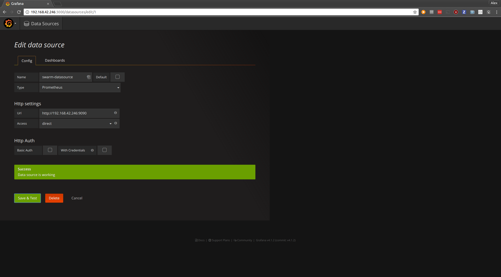

Docker Swarm-Mode Network Benchmark Tool
=======================================

This tool measures the network quality of service across all nodes in a Swarm by
capturing the following metrics over an extended time period:
- UDP and TCP packet loss rate and round-trip delay time for all links
- Percentage of Docker Engine Gossip traffic per link
- Network Partition & Merge transient times

Individual measurements will be stored on a local volume on each node. When the
benchmark operation is stopped, these measurements will be gathered on the tool
runner container and processed into final results

Usage (engine 1.13 or higher)
=============================

To start the network benchmark tool, 

1) Run the following command on a swarm manager node:
	```
		docker run --rm -v inventory:/inventory -v /var/run/docker.sock:/var/run/docker.sock alexmavr/swarm-nbt start
	```

2) Expose port 3000 on that manager and visit it through the browser. Username:
admin, Password: admin

3) Click on the top-left menu and browse to Data Sources. Create a prometheus
datasource with any name and point it to `http://<some-node-IP>:9090`. Set
access to "direct" and do not use any credentials:

 

4) Click on the top-left menu, highlight "Dashboards" and select the "Import"
option. Import the grafana dashboard from the `grafana.json` file included in
this repository. Use the prometheus datasource from step 3.

To stop the benchmark tool, run the following command on the initial swarm
manager node
	```
		docker run --rm -v /var/run/docker.sock:/var/run/docker.sock alexmavr/swarm-nbt stop  
	```

Viewing Metrics 
===============

The benchmark tool starts a prometheus server service on port 9090 and a grafana
service on port 3000 of all nodes in the cluster. The metrics can be viewed
either directly on prometheus or using the graphana dashboard.

Engine 1.12 Compatibility Mode with Docker Swarm (not Swarm-Mode)
====================================================

This tool can be ran when the local docker client is pointing to a Docker Swarm
cluster rather than a single engine, such as Docker Universal Control Plane,
with the following invocation:

* Start benchmark: This command will output a series of docker operations to be
  ran against the same shell
```
docker info | docker run -i -v inventory:/inventory --rm alexmavr/swarm-nbt start --compat
```

* Stop benchmark: 
```
docker info | docker run -i --rm alexmavr/swarm-nbt stop --compat
```


